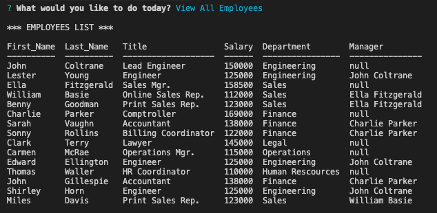

# MySQL-EmployeeTracker
Architect and build a solution for managing a company's employees using Node, Inquirer, and MySQL.
## Homework Assignment - Week 12

## *Table of Contents*
- [Description](#description)
 - [Installation](#installation)
 - [Usage](#usage)
 - [Contributing](#contributing)
 - [Authors](#authors)
 - [Screenshots](#screenshots)
 - [Contact Me](#contact-me)
 - [License](#license)

## *Description* 
Assignment is to build a solution for managing a company's employee database using Node, Inquirer and MySQL to be able to view, add and update employees, departments and roles.

## *Installation* 
Clone the Github repo.
```https://github.com/CRich96/MySQL-EmployeeTracker.git```

Once in the properly cloned folder, run ```npm install``` to install the following dependencies:
 * Inquirer:  ```npm i inquirer```
 * MySQL:  ```npm i mysql``` 
 * Console Table:  ```npm i console.table``` for an easy to read table in your terminal.

 * Add database Schemas and Seeds files to your MySql Workbench to create initial tables.
 * Provide your MySql Workbench password in the ```tracker.js``` file (line 9) to establish your connection.

## *Usage*
 Enter ```npm start``` in your command line to begin the queries. 

## *Contributing* 
 Please contact me to contribute.

## *Authors* 
Christian Richard

## *Screenshots* 





## *Contact Me*
 - Github: **[CRich96](https://github.com/CRich96)**
 - Email: **[chris575502@icloud.com](mailto:chris575502@icloud.com)**

## *License* 
This project is [MIT](https://github.com/CRich96/MySQL-EmployeeTracker/blob/main/LICENSE) Licensed.
 
 &copy; 2023, Christian Richard